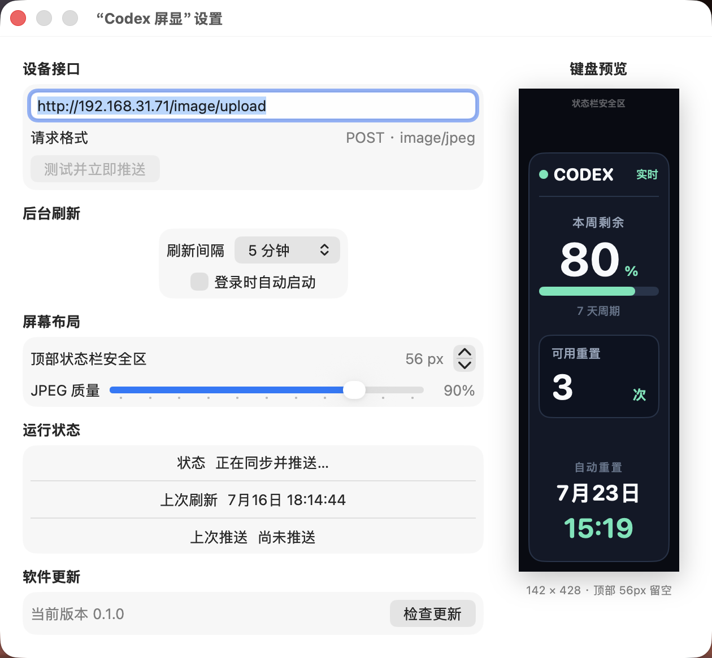
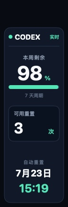

# Codex 屏显 for Linx68

一个常驻 macOS 菜单栏的小工具：读取本机 Codex 用量，生成适配 Linx68 竖屏的中文卡片，并定时推送到键盘的图像 API。



## 功能

- 显示 Codex 本周剩余用量、可用重置次数和自动重置时间。
- 输出固定为 `142 × 428` 的 JPEG，顶部默认保留 `56px` 给键盘天气、Wi-Fi 与电量状态栏。
- 自定义图像 API 地址、推送间隔、JPEG 质量和顶部安全区。
- 支持立即测试、后台定时推送和登录时自动启动。
- 菜单栏与设置页均可点击“检查更新”，发现新版本后可直接下载并安装。
- 原生 SwiftUI 菜单栏 App，不需要额外服务器。

<p align="center">
  
</p>

## 系统要求

- macOS 14 或更高版本，支持 Apple 芯片和 Intel Mac。
- 已登录的 Codex App 或 Codex CLI。
- Mac 与键盘位于同一局域网，键盘固件已开启图像 API。

## 安装

1. 从 [Releases](https://github.com/luweihuang/CodexLinxDisplay/releases/latest) 下载最新的 `CodexLinxDisplay-*.dmg`。
2. 打开 DMG，将 `CodexLinxDisplay.app` 拖入“应用程序”。
3. 启动 App；首次推送时允许 macOS 的“本地网络”权限。

App 不显示在 Dock 中，启动后请在菜单栏找到竖屏图标。

## 使用

1. 打开“设置”，填写键盘图像接口。Linx68 的默认示例为：

   ```text
   http://192.168.31.71/image/upload
   ```

2. 点击“测试并立即推送”。设备应收到一张 `Content-Type: image/jpeg` 的 POST 请求。
3. 确认显示正常后选择刷新间隔；需要常驻时可打开“登录时自动启动”。

接口地址会因设备网络而变化，请以键盘当前显示或固件页面为准。

## 软件更新

App 使用 [Sparkle](https://sparkle-project.org/) 检查 GitHub Releases。点击菜单栏或设置页中的“检查更新”；有新版本时，Sparkle 会展示更新说明并完成下载、验证和安装。

## 隐私

Codex 用量在本机读取并渲染。App 不上传 Codex 凭据；它只会把生成后的 JPEG 发送到用户配置的图像 API，并访问 GitHub Release 更新源。

## 本地构建

需要 Xcode 16+ 与 [XcodeGen](https://github.com/yonaskolb/XcodeGen)：

```bash
brew install xcodegen
xcodegen generate
xcodebuild \
  -project CodexLinxDisplay.xcodeproj \
  -scheme CodexLinxDisplay \
  -configuration Debug \
  -derivedDataPath .build \
  test
```

生成本地 DMG、更新 ZIP 与 Sparkle 清单：

```bash
./scripts/build-release.sh
./scripts/generate-appcast.sh
```

## 维护者发布

推送形如 `v0.2.0` 的 tag 会触发 `.github/workflows/release.yml`，完成通用架构构建、Developer ID 签名、Apple 公证、Sparkle 签名与 GitHub Release 上传。正式发布前需在仓库配置以下 Actions Secrets：

- `BUILD_CERTIFICATE_BASE64`
- `P12_PASSWORD`
- `KEYCHAIN_PASSWORD`
- `DEVELOPER_ID_APPLICATION`
- `APPLE_ID`
- `APPLE_TEAM_ID`
- `APPLE_APP_SPECIFIC_PASSWORD`
- `SPARKLE_PRIVATE_KEY`

Sparkle 私钥已按账户 `com.olivia.CodexLinxDisplay` 保存在创建者的 macOS 钥匙串中，可用依赖包内的 `generate_keys --account com.olivia.CodexLinxDisplay -x <文件>` 导出后写入 GitHub Secret。私钥文件不要提交到仓库。

发布前同步修改 `project.yml` 中的 `CFBundleShortVersionString` 与 `CFBundleVersion`，更新 `CHANGELOG.md`，然后创建对应 tag。

## 说明

这是面向 Linx68 图像 API 的非官方工具，与 OpenAI 或键盘厂商无隶属关系。
